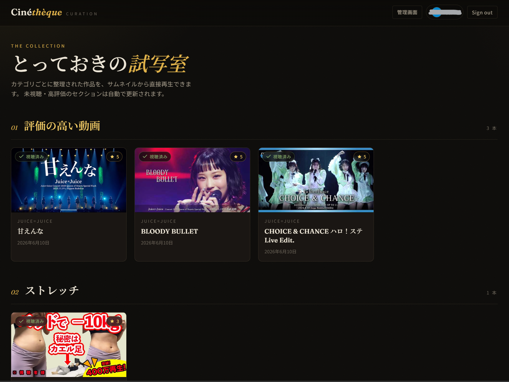
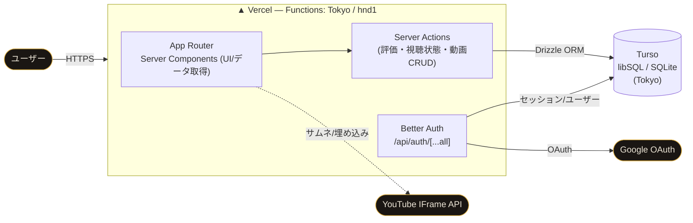

# Cinéthèque — favorite-video-curation

> お気に入りの YouTube 動画をカテゴリごとに集め、再生・評価できる動画キュレーション Web アプリ。
> 「自分だけのプライベート試写室」をコンセプトに、シネマテーク調のダークテーマで実装しました。

<p>
  
  
  
  
  
  
  
</p>

~🔗 **本番デモ**: <https://favorite-video-curation.vercel.app>~
~（**Google アカウントがあれば誰でもログインして試せます**。ログインユーザーは動画の登録・編集も可能です）~
<br/>
※公開停止しました。

<!-- スクリーンショットを入れる場合はこの下に追加してください -->


---

## 📌 このアプリでできること

| 機能 | 概要 |
| --- | --- |
| 🔐 **Google ログイン** | Better Auth による OAuth 認証。未ログインは自動でログイン画面へ |
| 🗂 **カテゴリ別の動画一覧** | サムネイルのグリッド表示。カテゴリは自由に作成可能 |
| ✨ **自動更新される動的カテゴリ** | 「未視聴の動画」「評価の高い動画（全ユーザー平均 ★4.0 以上）」を状態に応じて自動生成 |
| ▶️ **インライン再生** | サムネクリックでその場の YouTube プレーヤーに切り替えて再生 |
| 👁 **視聴済みの自動記録** | YouTube IFrame Player API で再生開始を検知し、視聴済みを自動で記録 |
| ⭐ **★5段階評価** | ユーザーごとに評価を保存。「未視聴に戻す」も可能 |
| 🛠 **動画管理（CRUD）** | 追加・編集・削除。公開／非公開の切り替え（非公開は一般一覧に出さず管理画面のみ表示） |

---

## 🏗 アーキテクチャ

Next.js（App Router）に一本化したフルスタック構成。専用の API サーバーを持たず、データ取得は **Server Components**、更新系は **Server Actions** に集約しています。



**ポイント**: Vercel の関数リージョンを東京（`hnd1`）に固定し、東京リージョンの Turso DB と co-locate することで DB 往復のレイテンシを削減しています。

---

## 🧰 技術スタック

| レイヤー | 採用技術 | 選定理由 |
| --- | --- | --- |
| フロント / バック | **Next.js 15（App Router）/ React 19 / TypeScript** | Server Components / Server Actions で UI とサーバー処理を型安全に一体化 |
| データベース | **Turso（libSQL / SQLite）** | エッジ分散・低レイテンシ。無料枠が広くポートフォリオ運用に最適 |
| ORM | **Drizzle ORM** | スキーマ定義からマイグレーションと型を自動生成。SQL に近く軽量 |
| 認証 | **Better Auth（Google OAuth）** | 自前ホスト型でセッションを DB 管理。ベンダーロックインを回避 |
| テスト | **Vitest** | コアロジックのユニットテスト |
| 基盤 | **pnpm / Vercel / GitHub** | `main` への push で自動デプロイ（CI/CD） |

---

## 💡 技術的に工夫した点

- **API レスなフルスタック設計** — REST/GraphQL の別レイヤーを作らず、Server Actions に更新処理を集約。型がフロントからDBまで一貫して通る構成にしました。
- **動的カテゴリを SQL 集計で実現** — 「未視聴」「高評価（全ユーザー平均 ★4.0 以上）」を、ユーザー状態テーブルの集計クエリ（`AVG ... HAVING`）と LEFT JOIN で動的に算出。
- **YouTube IFrame Player API 連携** — 再生開始イベント（`PLAYING`）を検知して視聴済みを一度だけ記録する Client Component を実装。
- **テスト駆動の規律** — URL→videoID 解析や評価集計などの中核ロジックを純粋関数に切り出し、入力バリエーション込みで Vitest 検証（26ケース）。「テストを通すためにテスト仕様を曲げない」運用ルールを [`CLAUDE.md`](CLAUDE.md) に明文化。
- **アクセシビリティ / 品質** — `focus-visible` リング、`color-scheme`、`prefers-reduced-motion`、セマンティック HTML、画像の明示サイズなどを Web Interface Guidelines に沿って整備。ESLint・型チェックともにクリーン。
- **設計ドキュメントを残す開発** — 仕様確定の壁打ち → 実装計画（[`plans/implementation-plan.md`](plans/implementation-plan.md)）→ 進捗ログ（[`plans/tasks.md`](plans/tasks.md)）→ デプロイ手順（[`docs/deployment.md`](docs/deployment.md)）まで文書化。

---

## 🗺 画面 / ルーティング

| パス | 画面 |
| --- | --- |
| `/login` | Google ログイン |
| `/` | 動画一覧（未視聴・高評価＋カテゴリ別） |
| `/videos/[id]` | 動画詳細（再生・評価・未視聴に戻す） |
| `/admin` | 管理画面（動画追加・カテゴリ別リスト） |
| `/admin/videos/new`・`/admin/videos/[id]` | 動画の追加・詳細管理（編集／削除） |

### データモデル（主要テーブル）

- `videos` — 動画（YouTube videoID / カテゴリ / タイトル / 公開フラグ / 登録日時）
- `user_video_states` — ユーザー × 動画の状態（視聴済み / 評価）。`(user_id, video_id)` でユニーク
- `user` / `session` / `account` / `verification` — Better Auth 管理

---

## 🧪 テスト

中核ロジック（`lib/youtube.ts` / `lib/rating.ts`）を純粋関数に分離し、Vitest で検証しています。

```bash
pnpm test:run     # 26 ケース
```

---

## 🚀 ローカルで動かす

前提: Node.js 18+ / pnpm（`corepack enable pnpm`）

```bash
pnpm install
cp .env.example .env          # ローカルは TURSO_DATABASE_URL="file:./local.db" でも可
pnpm db:migrate               # スキーマをDBへ適用
pnpm seed                     # サンプル動画を投入（任意・ローカル専用）
pnpm dev                      # http://localhost:3000
```

Google OAuth のクライアント取得や本番（Vercel + Turso）への手順は [`docs/deployment.md`](docs/deployment.md) を参照してください。

---

## 📁 ディレクトリ構成（抜粋）

```
src/
  app/            # ルーティング（一覧 / 詳細 / 管理 / 認証API）
  components/     # UI（VideoCard, StarRating, VideoPlayer, Header ...）
  actions/        # Server Actions（評価・視聴状態・動画CRUD）
  lib/            # db(schema/drizzle), auth, youtube, rating, videos
tests/            # Vitest（純粋関数）
drizzle/          # マイグレーション
docs/ plans/      # 設計・デプロイ・進捗ドキュメント
```
