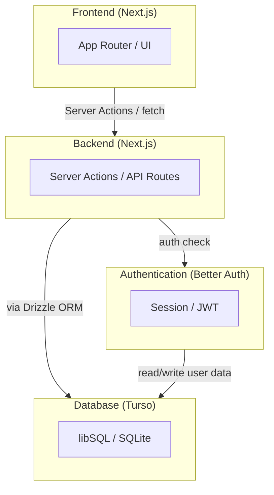

## このファイルについて
Claude Codeとのチャット履歴をここにまとめた。
何もない状態からWebアプリを作成したときの流れを把握するためにここに保存している。

## Chat1
`/plan` モードに切り替えて最初は設計フェーズを進める。

---

これから、YouTubeの気に入った動画を登録したり、登録した動画を再生するWebアプリを作っていきます。
以下の仕様を読んでから、このWebアプリを実装するために必要な内容について壁打ちをしていきたいので、私に質問をしてください。

### Webアプリの概要
・YouTubeの動画の埋め込みを登録、および、登録した動画を再生する
・管理者およびユーザーの認証を行う
・管理者は管理画面でカテゴリごとにYouTubeの動画を登録（リンクをDBに追加）する
・YouTubeの動画を登録するときには、カテゴリ、表示タイトル、サムネイル画像、公開／非公開、登録日時（自動で付与）を設定する
・一般ユーザおよび管理者は、動画一覧画面でカテゴリごとに表示されたサムネイルを選択して動画を再生する
・動画を見終わったら、閲覧済みのチェックが記録される
・ユーザーごとに動画の評価を☆で５段階評価ができるようにしたい
・動画一覧画面に「未視聴の動画」「評価の高い動画」のカテゴリも追加して自動でリストを更新して表示したい
・このアプリには決済の機能は不要
・動画のサムネイルはYouTubeサムネイルURLから取得して使用する
・管理者は自分だけ

### 画面構成
#### ログイン画面
- Google認証でログインの認証を行う
- ログイン成功したら動画一覧画面へ遷移

#### 共通のUI
- 画面上部に管理画面へ遷移するボタンを常時配置（管理者以外が押下したときは警告表示して画面遷移しない）
- 今回はサイドバーは使用しない

#### 動画一覧画面
- カテゴリごとに動画のサムネイルを表示
- ユーザーごとに、未視聴のカテゴリと、動画の評価ごとのカテゴリも追加して、状態が変更されるごとに更新する
- サムネイル画像はYouTubeのサムネイル画像を表示する
- サムネイル画像をクリックしたら動画詳細画面へ遷移

#### 動画詳細画面
- カテゴリ、表示タイトル、サムネイル画像、登録日時、評価を表示する
- サムネイル画像はYouTubeのサムネイル画像を表示する
- サムネイル画像をクリックしたら動画再生
- 動画の評価を☆５段階評価で変更可能（ユーザーごとにDBに情報を保存する）
- [未視聴に戻す]ボタンで未視聴の状態へ戻す（ユーザーごとにDBに情報を保存する）
- [Back]ボタンで動画一覧画面へ戻る

#### 管理画面
- 画面上部に[Add Video]ボタンを常時表示して、このボタンで動画追加画面に遷移
- カテゴリごとに動画のリストを表示して、リストをクリックすると詳細管理画面へ遷移

#### 動画追加画面
- カテゴリ、表示タイトル、YouTubeの動画URL、公開／非公開の切り替えボタン
- カテゴリは既存のものから選択できるし、任意の文字列を入力してもOK
- 表示タイトルは任意の文字列を入力
- [Submit]ボタン押下で、動画の情報をDBへ保存して管理画面へ戻る
- [Back]ボタンで管理画面へ戻る

#### 詳細管理画面
- カテゴリ、表示タイトル、YouTubeの動画URL、サムネイル画像、公開／非公開の切り替えボタン、登録日時を表示
- カテゴリ、表示タイトル、公開／非公開は変更可能
- [Remove]ボタンで動画の情報をDBから削除して管理画面へ戻る
- [Back]ボタンで管理画面へ戻る

### コンポーネントの構成
**Components list**
| Component | Technology | Details |
| --- | --- | --- |
| Frontend | Next.js | App Router / UI |
| Backend | Next.js | Server Actions / API |
| Database | Turso | libSQL / SQLite |
| Authentication | Better Auth | Session / JWT |

**Components chart**

**Descriptions**
- Next.js: React をベースにしたフルスタック Web フレームワーク
- Turso: SQLiteをベースにした分散型クラウドDBサービス（libSQL）
- Better Auth: Next.js向けの認証用ライブラリ（自前ホスト型）

### 使用するSkills
frontend-design, vercel-react-best-practices, web-design-guidelines

### 実装計画の出力
実装のプランが完成したら、Markdown形式で`./plans`フォルダに出力してください。

---

## Chat2

---

@plans/implementation-plan.md の「12. テスト方針」を加筆修正して最低限必要なテストコードの仕様書になるようにしてください。

---

## Chat3

---

テストに合格するためにテストの仕様書自体を変更しないように、CLAUDE.mdファイルでそのルールを決めておいてください。

---

## Chat4

---

@plans/implementation-plan.md 実装計画をもとにタスクの進捗がわかるように @plans/tasks.md を作成して、実装の記録が残るようにしてください。 

---

## Chat5

---

@CLAUDE.md に、
「実装の際には仕様書を確認してから実装及びテストするようにしてください。実装が完了したら、 @plans/tasks.md の内容をきちんと更新するようにしてください。」
と追加しておいてください。

---

## Chat6

---

 @plans/implementation-plan.md 実装プランを見て実装を開始してください。
 
---

### Google OAuth クレデンシャル取得
この実装が完了した時点ではまだGoogle認証が疎通していないので、以下の手順で値を取得する

1. Google Cloud Console を開く
https://console.cloud.google.com/
Google Cloud Console にログインします。

2. 認証機能を紐づけるためのプロジェクトを作成
defaultでは画面左上の`Google Cloud`の表示の隣に`My First Project`というdefaultのプロジェクトが選択されている。

ここをクリックして認証機能を紐づけるためのプロジェクトを作成する。

3. OAuth 同意画面を設定する
左メニュー > API とサービス > OAuth 同意画面

「Google Auth Platform はまだ構成されていません」
と表示されているので［開始］

・アプリ名：`favorite-video-curation`
・ユーザーサポートメール：`{自分のメルアド}`
・ユーザータイプ: `外部`（誰でも使えるようにする）
・連絡先情報：`{自分のメルアド}`
・✅Google API サービス: ユーザーデータに関するポリシー に同意します。
・［作成］押下

4. OAuth クライアント ID を作成する
メニュー > API とサービス > 認証情報 > [+ 認証情報を作成] > OAuth クライアント ID

・アプリケーションの種類：`ウェブアプリケーション`
・名前：`favorite-video-curation`
・承認済みのリダイレクト URI：
　ローカル開発中は
　　`http://localhost:3000/api/auth/callback/google`
　デプロイしたら、
　　`https://<あなたのドメイン>/api/auth/callback/google`など
　をBETTER_AUTH_URL と同じオリジンにあわせる
・［作成］押下

5. クライアント ID / シークレットをコピーする
作成後に表示される:

クライアント ID → GOOGLE_CLIENT_ID
クライアント シークレット → GOOGLE_CLIENT_SECRET
.env に貼り付けます。

GOOGLE_CLIENT_ID="<YOUR-CLIENT-ID>"
GOOGLE_CLIENT_SECRET="<YOUR-CLIENT-SECRET>"
BETTER_AUTH_URL="http://localhost:3000"

ここまでやってから、Claudeとは別のターミナルで `npm run dev` でローカルサーバーを起動
http://localhost:3000/ をWebブラウザで開いて動作確認できた。

その他の残件は以下の通り

### シードの実動画 — 登録したい YouTube URL／カテゴリをご指定いただければ差し替えます（現在はサンプル）

### 高評価カテゴリの確認データ — 擬似評価を入れるか（実ユーザー紐付けの都合）

### デプロイ — Vercel + Turso 本番設定、OAuth リダイレクトURI / BETTER_AUTH_URL

